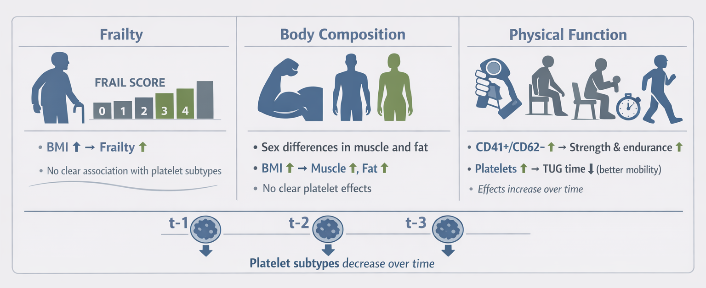

# Overview

{width=100% style="border-radius:10px"}

[...].

```{r}
#| include: false
# Load libraries
library(data.table)
library(brms)
library(tidybayes)
library(ggplot2)
library(gtsummary)

# Load data
load("../data/platelets_d.RData")

# Load models (only adjusted ones)
cc_m <- readRDS("../models/cc_model_adj.rds")
frail_m <- readRDS("../models/frail_model_adj.rds")
func_m <- readRDS("../models/function_model_adj.rds")

# Load custom function
source("../R/_functions.R")

# Load other data objects
tbl_1 <- readRDS("../output/tbl-1.rds")
```


# Results

## Sample characterization

The study included 137 participants, of whom 42 (30.7%) were male and 95 (69.3%) were female. The mean age of the sample was 70.4 ± 6.1 years, with no meaningful difference between sexes (70.9 ± 5.9 in males vs 70.2 ± 6.3 in females). Cardiometabolic conditions were common, with diabetes present in 32.8% of participants and hypertension and dyslipidemia each affecting 62.0% of the sample. 

Anthropometric measures differed by sex. Males were taller (165.3 ± 7.3 cm vs 152.9 ± 7.2 cm) and had lower BMI (29.1 ± 4.3 vs 31.9 ± 7.0 kg/m²). Body composition also showed marked differences, with males presenting lower total fat mass (24.6 ± 5.8% vs 40.3 ± 6.5%) and higher total muscle mass (56.2 ± 7.7 kg vs 41.3 ± 5.7 kg), appendicular muscle mass, skeletal muscle index, body water percentage, and bone mass.

Physical performance measures were consistently higher in males. Average handgrip strength was 32.1 ± 5.3 kg in males and 21.2 ± 4.4 kg in females, and males also showed slightly higher repetitions in chair sit-to-stand and elbow flexion tests. In contrast, females had longer timed up-and-go durations (6.4 ± 2.0 vs 5.2 ± 1.5 seconds), indicating lower mobility performance.  Frailty distribution was skewed toward lower scores, with 53.7% of participants scoring 0 and fewer than 2% scoring 3 or 4. Platelet subtype distributions were similar between sexes, with no clear differences in the relative proportions of CD41^+^/CD62^-^ and CD41^+^/CD62^+^ platelets. The complete sample characterization can be observed in table 1.

```{r}
#| echo: false
tbl_1
```

**Table 1**. Sample description and sociodemographic characterization. Data is presented as mean ± standard deviation for numerical variables, meanwhile absolute and relative frequency was used for discrete ones. Difference between males and females is based on standardized mean difference with 95% confidence interval.

### Frailty model

```{r}
#| include: false
report_model(frail_m, variable = "^b|^rescor")
```

In the frailty model, the strongest and most consistent association was with BMI. The coefficient for standardized BMI, was positive and clearly different from zero ($\beta$ = 0.48, CI~95%~[0.25, 0.7], pd = 100%, ps = 99.9%), indicating higher frailty scores at higher BMI after adjustment for time, sex, age, and platelet subtypes. Age showed a smaller positive association that was compatible with a modest effect, although the interval approached the null ($\beta$ = 0.24, CI~95%~[-0.01, 0.48], pd = 97.5%, ps = 87.1%). Sex was not clearly associated with frailty ($\beta$ = 0.25, CI~95%~[-0.3, 0.81], pd = 81.2%, ps = 70.6%). The polynomial time terms did not provide strong evidence of a trend in frailty across visits ($\beta$ = -0.36, CI~95%~[-1.17, 0.44], pd = 81.1%, ps = 74%). The interaction terms between time and sex, age, or BMI were also compatible with no clear effect modification, as all intervals spanned zero with low posterior probability. 

For the platelet predictors, there was mild evidence that platelet subtype was associated with frailty at the reference time structure of the model. The main effect of the CD41^+^/CD62^-^ percentage was negative, suggesting that higher proportions of this platelet subtype were linked with lower frailty scores, however these effects were uncertain ($\beta$ = -0.19, CI~95%~[-0.65, 0.28], pd = 79.4%, ps = 64.9%). On the contrary, the corresponding effect from CD41^+^/CD62^+^ subtype on frailty scores was essentially null ($\beta$ = 0.01, CI~95%~[-0.35, 0.36], pd = 51.9%, ps = 30.2%). Likewise, the time-by-platelet interactions were imprecise for CD41^+^/CD62^-^ subtypes for linear interaction effects ($\beta$ = 0.36, CI~95%~[-0.33, 1.04], pd = 85.5%, ps = 77.9%). Similar findings were observed for CD41^+^/CD62^+^ ($\beta$ = 0.29, CI~95%~[-0.25, 0.84], pd = 84.8%, ps = 75.2%). Taken together, the estimates from this model suggest that the effect of platelet subtype on frailty scores were relatively constant over time (i.e., no time-by-platelet interaction), whereas the CD41^+^/CD62^-^ platelet subtype was deemed protective against frailty. However, these effects are based on uncertain estimates and should be regarded as suggestive trends rather than definitive evidence of a mechanistic link.

The platelet submodels, however, did show a clear temporal pattern. The percentage of CD41^+^/CD62^-^ platelets declined over time, with both the linear and quadratic terms strongly negative (linear effect, $\beta$ = -0.96, CI~95%~[-1.13, -0.79], pd = 100%, ps = 100%; quadratic effect, $\beta$ = -0.48, CI~95%~[-0.65, -0.3], pd = 100%, ps = 100%). The CD41^+^/CD62^+^ percentage also tended to decrease, though more modestly ($\beta$ = -0.24, CI~95%~[-0.45, -0.02], pd = 98.7%, ps = 91.1%). Thus, the main temporal signal in the frailty model was not a strong outcome change in frailty itself, but a downward trend in platelet composition over follow-up. 

### Body composition model

```{r}
#| include: false
report_model(cc_m, variable = "^b|^rescor")
```

The body-composition model showed pronounced sex differences and a clear association with BMI, but little evidence that platelet subtype levels were directly related to muscle or fat mass. For muscle mass, the sex effect was large and negative for females relative to males ($\beta$ = -1.63, CI~95%~[-1.83, -1.42], pd = 100%, ps = 100%), suggesting lower muscle mass in female counterparts. Age was weakly negative ($\beta$ = -0.11, CI~95%~[-0.2, -0.01], pd = 98.8%, ps = 56.9%). For fat mass, the sex effect reversed in direction and was strongly positive ($\beta$ = 1.32, CI~95%~[1.18, 1.46], pd = 100%, ps = 100%), indicating higher adiposity in female subjects compared to males. These estimates indicate substantial sex-related differences in body composition and a robust positive relation between BMI and both standardized body-composition outcomes.

The time effects for body composition were small and not clearly different from zero. The time-by-covariate interactions were also largely null, suggesting no strong evidence that the adjusted associations of sex, age, or BMI with body composition changed over the three visits. 

The platelet terms in the body-composition outcomes were also imprecise. For muscle mass, the main effects of the platelet variables were close to zero for both platelet phenotypes (CD41^+^/CD62^-^, $\beta$ = -0.04, CI~95%~[-0.82, 0.69], pd = 55.7%, ps = 43.2%; CD41^+^/CD62^+^, $\beta$ = -0.02, CI~95%~[-0.79, 0.59], pd = 53%, ps = 38.7%), suggesting that platelet subtype is not associated with body composition in elderly individuals. For fat mass, the corresponding terms were similarly weak (CD41^+^/CD62^-^, $\beta$ = -0.04, CI~95%~[-0.71, 0.66], pd = 56.5%, ps = 40.8%; CD41^+^/CD62^+^, $\beta$ = -0.05, CI~95%~[-0.21, 0.11], pd = 75%, ps = 28%). The interaction terms with time were also compatible with no compositional effect modification. The residual correlation between muscle and fat mass was negative but uncertain ($r$ = -0.49, CI~95%~[-0.84, 0.16], pd = 92.1%, ps = 87.9%), suggesting possible inverse co-variation that was not precisely estimated in this sample. The two platelet subtypes were strongly inversely correlated with each other ($\beta$ = -0.54, CI~95%~[-0.65, -0.43], pd = 100%, ps = 100%). Overall, the model supports strong anthropometric patterning by sex and BMI, but not a clear platelet-body composition association. 

### Physical function model

```{r}
#| include: false
report_model(func_m, variable = "^b|^rescor")
```

The physical-function model showed the clearest set of associations with platelet subtype, especially for the CD41^+^/CD62^+^ percentage. For handgrip strength, the females had lower estimated hand strength compared with their male counterparts ($\beta$ = -1.52, CI~95%~[-1.76, -1.27], pd = 100%, ps = 100%), and age was also associated with lower average handgrip values ($\beta$ = -0.12, CI~95%~[-0.23, -0.01], pd = 98.5%, ps = 66.7%). The time terms for handgrip were not clearly different from zero ($\beta$ = 0.28, CI~95%~[-0.33, 0.87], pd = 83.8%, ps = 74%). Importantly, a small effect was observed for platelets subtypes, suggesting that higher proportions in both phenotypes were linked with greater handgrip levels (CD41^+^/CD62^-^, $\beta$ = 0.37, CI~95%~[-0.28, 0.89], pd = 89.4%, ps = 82.5%; CD41^+^/CD62^+^, $\beta$ = 0.3, CI~95%~[-0.24, 0.85], pd = 87.4%, ps = 78.2%). This pattern suggests that platelet composition could meaningfully predict, at least partially, average grip strength in the adjusted models accounting for confounding factors.

By contrast, chair sit-to-stand performance and elbow flexion showed positive associations with the CD41^+^/CD62^+^ subtype. For chair sit-to-stand, higher CD41^+^/CD62^-^ was indicative of better performance ($\beta$ = 1.57 CI~95%~[0.32, 2.69], pd = 98.9%, ps = 98.4%), and the interaction with the linear time contrast was also positive ($\beta$ = 0.29, CI~95%~[0, 0.58], pd = 97.5%, ps = 90%), suggesting that as time goes by, the effect of CD41^+^/CD62^-^ on chair sit-to-stand performance further increases. The CD41^+^/CD62^+^ subtype showed a similar effect association, although more uncertain, with the same outcome ($\beta$ = 0.96, CI~95%~[-0.46, 2.08], pd = 91.6%, ps = 89.4%), although its linear interaction was also positive ($\beta$ = 0.2, CI~95%~[0, 0.42], pd = 97.3%, ps = 82.6%). For elbow flexion, the CD41^+^/CD62^+^ term was again positive ($\beta$ = 1.28, CI~95%~[0.19, 2.31], pd = 98.1%, ps = 97.5%), with a suggestive but less definitive linear interaction ($\beta$ = 0.26, CI~95%~[-0.06, 0.59], pd = 93.4%, ps = 82.4%). These results indicate that higher CD41^+^/CD62^+^ platelet percentages were associated with better performance in the upper- and lower-limb endurance tests, and that at least part of this association strengthened over time.

Timed up-and-go showed the opposite direction. The main effects of the platelet subtype were negative (CD41^+^/CD62^+^, $\beta$ = -1.21, CI~95%~[-2.2, -0.06], pd = 97.3%, ps = 96.4%; CD41^+^/CD62^-^, $\beta$ = -1.08, CI~95%~[-2.18, 0.09], pd = 96.3%, ps = 94.9%). Because the timed up-and-go outcome is measured in seconds, lower values indicate better performance, so these estimates are consistent with better mobility at higher platelet percentages, particularly for the CD41^+^/CD62^+^ subtype. The time interaction terms for timed up-and-go were not clearly different from zero (CD41^+^/CD62^-^, $\beta$ = -0.04, CI~95%~[-0.32, 0.25], pd = 61.5%, ps = 34.3%; CD41^+^/CD62^+^, $\beta$ = -0.03, CI~95%~[-0.24, 0.17], pd = 61.7%, ps = 24.8%). The direct time effects for the function outcomes were also informative: chair stand and elbow flexion increased over time (chair sit-to-stand, $\beta$ = 1.76, CI~95%~[0.66, 2.83], pd = 99.8%, ps = 99.7%; elbow flexion test, $\beta$ = 2.03, CI~95%~[1.05, 3.09], pd = 99.9%, ps = 99.9%), whereas timed up-and-go times declined ($\beta$ = -1.14, CI~95%~[-2.14, -0.12], pd = 98.2%, ps = 97.5%). Finally, the residual correlations were substantial across the functional tests, especially between chair sit-to-stand and elbow flexion ($\beta$ = 0.86, CI~95%~[0.62, 0.96], pd = 100%, ps = 99.9%), and strongly negative between timed up-and-go and the strength/endurance measures (dinamometer - timed up-and-go, $r$ = -0.6, CI~95%~[-0.84, -0.23], pd = 99.4%, ps = 98.6%; chair sit-to-stand - timed up-and-go, $r$ = -0.82, CI~95%~[-0.95, -0.55], pd = 99.9%, ps = 99.9%; elbow flexion - timed up-and-go, $r$ = -0.77, CI~95%~[-0.93, -0.42], pd = 99.9%, ps = 99.7%). These residual associations support the multivariate specification and indicate that the function outcomes shared substantial unexplained variation. 

# Methods

## Statistical analysis

We analyzed the data using Bayesian multilevel regression models. Time was treated as an ordered factor with three occasions (t-1, t-`, and t-3), and the model used polynomial contrasts for this factor. Accordingly, the time effect was represented by two orthogonal components, a linear term and a quadratic term, rather than by pairwise comparisons against a single reference level. The main aim of the models was to evaluate whether the longitudinal association between platelet subtypes and the study outcomes changed over time, while adjusting for sex, age, and body mass index (BMI). Participant-level heterogeneity was modeled through random intercepts. Because the same participants contributed repeated measurements, this random-intercept structure was used to account for within-person correlation across visits.

Let $i = 1,\dots,N$ index participants and $t \in \{1,2,3\}$ index measurement occasions. Let

$$
\mathbf{z}_{it} =
\begin{pmatrix}
P^{-}_{it} \\
P^{+}_{it} \\
\text{sex}_i \\
\text{age}_{i} \\
\text{BMI}_{i}
\end{pmatrix},
$$

where $P^{-}_{it}$ denotes the standardized percentage of CD41$^+$/CD62$^-$ platelets and $P^{+}_{it}$ denotes the standardized percentage of CD41$^+$/CD62$^+$ platelets. To represent the ordered time factor, let

$$
\mathbf{c}_t =
\begin{pmatrix}
L_t \\
Q_t
\end{pmatrix},
$$
where $L_t$ and $Q_t$ are the linear and quadratic polynomial contrast scores for time, respectively. This notation keeps the model specification compact while preserving the structure of the fitted formulas. In all cases, time-by-covariate terms were included so that the association between platelet composition and the outcomes could vary across the longitudinal trajectory in its linear and quadratic components.

### Frailty model

Frailty was analyzed as a binomial outcome with four trials per observation, corresponding to the FRAIL questionnaire score ranging from 0 to 4. Let $F_{it}$ denote the frailty score for participant $i$ at time $t$. The model was specified as

$$
F_{it} \sim \text{Binomial}(4, p_{it}),
$$

with logit link

$$
\text{logit}(p_{it}) = \eta^{(F)}_{it}.
$$

The linear predictor was written as

$$
\eta^{(F)}_{it}
= \alpha_F
+ \mathbf{c}_t^\top \boldsymbol{\tau}_F
+ \mathbf{z}_{it}^\top \boldsymbol{\beta}_F
+ (\mathbf{c}_t \otimes \mathbf{z}_{it})^\top \boldsymbol{\Gamma}_F
+ u^{(F)}_i,
$$
where $\alpha_F$ is the intercept, $\boldsymbol{\tau}_F$ contains the linear and quadratic time effects, $\boldsymbol{\beta}_F$ contains the main effects of platelet percentages and covariates, and $\boldsymbol{\Gamma}_F$ contains the interactions between the time polynomial terms and the predictors. The term $u^{(F)}_i \sim \mathcal{N}(0,\sigma_F^2)$ is the participant-specific random intercept. This formulation implies that the association between each platelet subtype and frailty can differ not only over time in general, but specifically across the linear and quadratic components of the ordered time factor. Because the platelet predictors were included through `mi()`, missing values were handled inside the model rather than by complete-case deletion, so uncertainty in those predictors was propagated into the frailty estimates.

Although the FRAIL questionnaire score has four ordered levels, it was modeled as a binomial count with four trials because the score is bounded between 0 and 4 and the `brms` formulation directly accommodates this structure. The resulting coefficients are interpreted on the log-odds scale. Exponentiating a coefficient gives an odds ratio associated with a one-unit increase in the predictor, holding the remaining covariates constant. The coefficients for the time contrasts represent the shape of change across the three measurement occasions: the linear term captures monotonic increase or decrease across time, and the quadratic term captures curvature. The interaction terms indicate whether that temporal pattern differs according to platelet subtype or covariate level.

### Body composition model

Muscle mass and fat mass were modeled jointly as a multivariate Gaussian outcome. Let $M_{it}$ denote standardized muscle mass and $G_{it}$ denote standardized fat mass. The joint response was

$$
\mathbf{Y}^{(C)}_{it}
=
\begin{pmatrix}
M_{it} \\
G_{it}
\end{pmatrix}
\sim
\mathcal{N}_2\!\left(
\boldsymbol{\mu}^{(C)}_{it},
\boldsymbol{\Sigma}^{(C)}
\right),
$$

where $\boldsymbol{\Sigma}^{(C)}$ is the residual covariance matrix. The outcome-specific linear predictor can be written compactly as

$$
\boldsymbol{\mu}^{(C)}_{it}
= \boldsymbol{\alpha}_C
+ \mathbf{B}_C \mathbf{z}_{it}
+ \mathbf{A}_C \mathbf{c}_t
+ \mathbf{G}_C (\mathbf{c}_t \otimes \mathbf{z}_{it})
+ \mathbf{u}^{(C)}_i.
$$

Here, $\boldsymbol{\alpha}_C$ is a 2-dimensional intercept vector, $\mathbf{B}_C$ contains the main effects for the two platelet variables and the adjustment covariates, $\mathbf{A}_C$ contains the linear and quadratic time effects, and $\mathbf{G}_C$ contains the corresponding time-by-predictor interaction terms. The random-intercept vector $\mathbf{u}^{(C)}_i$ captures subject-specific deviations for the two outcomes. This multivariate structure allows the two body-composition outcomes to be modeled jointly while estimating their residual correlation after adjustment for time, covariates, and participant-level heterogeneity.

This specification is useful because muscle mass and fat mass are biologically related and may show correlated variation that is not fully explained by the measured covariates. By modeling them jointly, the analysis exploits that dependence rather than treating the outcomes as statistically independent. The fixed effects quantify adjusted associations for each outcome separately, while the residual covariance matrix summarizes the remaining contemporaneous association between muscle and fat mass after accounting for the predictors in the model.

### Physical function model

Physical function was modeled in the same multivariate framework, but with four Gaussian outcomes. Let $D_{it}$ denote standardized average handgrip strength, $S_{it}$ standardized chair sit-to-stand performance, $E_{it}$ standardized elbow flexion performance, and $T_{it}$ standardized timed up-and-go performance. The joint response was

$$
\mathbf{Y}^{(F)}_{it}
=
\begin{pmatrix}
D_{it} \\
S_{it} \\
E_{it} \\
T_{it}
\end{pmatrix}
\sim
\mathcal{N}_4\!\left(
\boldsymbol{\mu}^{(F)}_{it},
\boldsymbol{\Sigma}^{(F)}
\right).
$$

The corresponding linear predictor was

$$
\boldsymbol{\mu}^{(F)}_{it}
= \boldsymbol{\alpha}_F
+ \mathbf{B}_F \mathbf{z}_{it}
+ \mathbf{A}_F \mathbf{c}_t
+ \mathbf{G}_F (\mathbf{c}_t \otimes \mathbf{z}_{it})
+ \mathbf{u}^{(F)}_i.
$$
As in the body-composition model, $\boldsymbol{\alpha}_F$ is a vector of intercepts, $\mathbf{B}_F$ contains the main effects, $\mathbf{A}_F$ contains the linear and quadratic effects of time, $\mathbf{G}_F$ contains the time-by-predictor interactions, and $\mathbf{u}^{(F)}_i$ denotes the participant-specific random intercepts. The covariance matrix $\boldsymbol{\Sigma}^{(F)}$ captures residual dependence among the four function outcomes after adjustment.

This multivariate specification is appropriate because the physical function tests are related but not identical aspects of performance. Handgrip strength, chair stand, elbow flexion, and timed up-and-go may share common determinants, yet each outcome also retains outcome-specific variation. Joint modeling allows the estimated associations with platelet subtypes to be assessed simultaneously across all four outcomes, while preserving their correlation structure. In practice, this is preferable to running separate univariate models if the aim is to compare effect patterns across the functional domain and to obtain a coherent multivariate summary.

### Estimation and interpretation

All models were estimated in a Bayesian framework. Posterior summaries were used to describe the adjusted associations between platelet subtypes and the outcomes. For each coefficient, we examined the posterior mean or median and the corresponding 95% credible interval. The main effects of the platelet variables describe associations across the longitudinal trend after accounting for the polynomial time structure, rather than associations at a single reference visit. The coefficients attached to $\mathbf{c}_t$ quantify the overall linear and quadratic shape of change across t-1, t-2, and t-3 when all continuous predictors are held constant. The time-by-predictor interaction terms indicate whether the relationship between platelet composition and the outcome changes in its linear or quadratic component over time.

For the frailty model, coefficients are interpreted on the log-odds scale and can be expressed as odds ratios by exponentiation. For the Gaussian models, coefficients are interpreted as expected changes in the standardized outcome per one-unit increase in the predictor, holding the other terms constant. Because the outcomes in the body-composition and physical-function models were standardized, the coefficients are directly comparable in standardized units across outcomes. The residual correlation matrices in the multivariate models were also examined, since they quantify the dependence among outcomes that remains after adjustment for the fixed effects and random intercepts.

Model interpretation focused on the magnitude and direction of the posterior estimates, together with uncertainty reflected in the credible intervals. Time-by-platelet interactions were treated as evidence of effect heterogeneity across the ordered follow-up trajectory, specifically whether the association differed in the linear or quadratic temporal component. In the multivariate models, a nonzero residual correlation suggests that outcomes still share variation beyond what is explained by the measured predictors, which supports the use of a joint modeling strategy rather than independent regressions.
